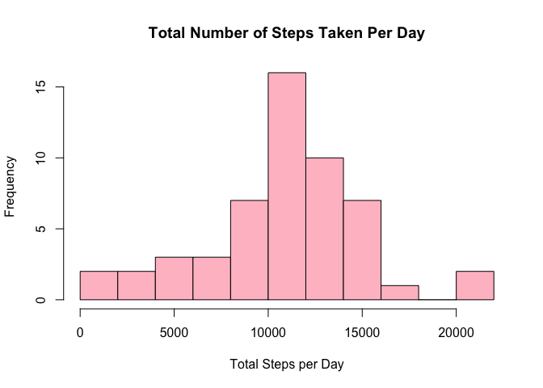
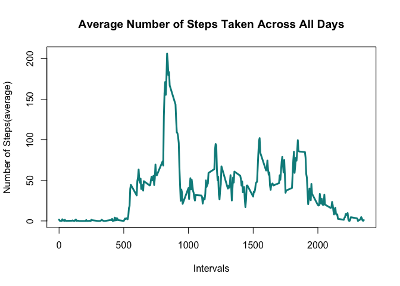
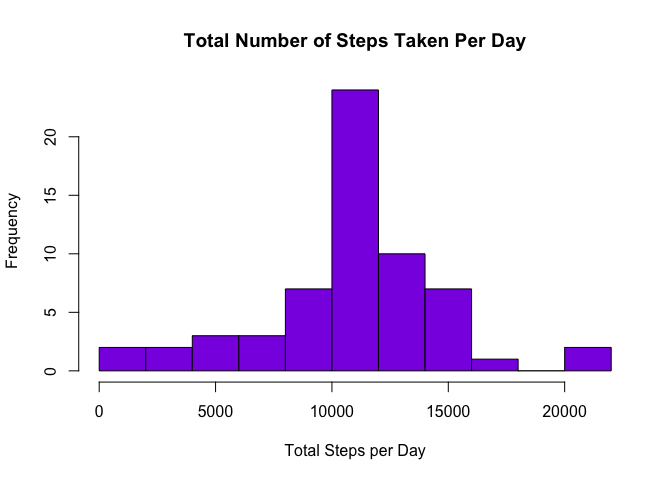
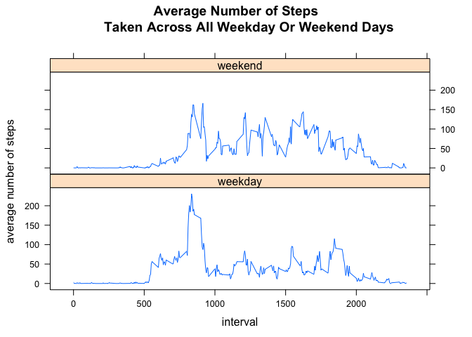

## Loading and preprocessing the data

Show any code that is needed to
1. Load the data
2. process/transform the data(if necessary) into a format suitable for your analysis.


```r
##load packages
library(dplyr)
```

```
## 
## Attaching package: 'dplyr'
```

```
## The following objects are masked from 'package:stats':
## 
##     filter, lag
```

```
## The following objects are masked from 'package:base':
## 
##     intersect, setdiff, setequal, union
```

```r
library(readr)
library(lattice)
##get data
fileURL <- "https://d396qusza40orc.cloudfront.net/repdata%2Fdata%2Factivity.zip"
download.file(fileURL, destfile = "./activity.zip", mode = "wb")
unzip(zipfile="./activity.zip", exdir="./data")
##read the data
activity <- read_csv("data/activity.csv", 
        col_types = cols(date = col_date(format = "%Y-%m-%d"), 
        interval = col_integer(), steps = col_number()))
```


## What is mean total number of steps taken per day?

For this part of the assignment, you can ignore the missing values in the dataset.

1. Calculate the total number of steps taken per day

```r
stepsDay <- aggregate(steps~date, activity, sum)
```

2. Make a histogram of the total number of steps taken each day

```r
hist(stepsDay$steps, main = "Total Number of Steps Taken Per Day", xlab="Total Steps per Day", 
     col = "pink", ylab="Frequency", breaks=10)
```

<!-- -->

3. Calculate and report the mean and median of the total number of steps taken per day

```r
mean(stepsDay$steps)
```

```
## [1] 10766.19
```

```r
median(stepsDay$steps)
```

```
## [1] 10765
```

## What is the average daily activity pattern?

1. Make a time series plot (i.e. type = "l") of the 5-minute interval (x-axis) and the average number of steps taken, averaged across all days (y-axis)


```r
stepsInt <- split(activity$steps, activity$interval)
meanStepsPerInt <- sapply(stepsInt, mean, na.rm=TRUE)
##make list of intervals
intervalsUnique <- unique(activity$interval)
##Plot the time-series graph
plot(intervalsUnique, meanStepsPerInt, type="l", xlab="Intervals", 
     ylab="Number of Steps(average)", 
     main="Average Number of Steps Taken Across All Days", 
     lwd=3, 
     col="darkcyan")
```

<!-- -->

2. Which 5-minute interval, on average across all the days in the dataset, contains the maximum number of steps?


```r
maxStepInterval <- meanStepsPerInt[which.max(meanStepsPerInt)]
maxStepInterval
```

```
##      835 
## 206.1698
```

## Imputing missing values

Note that there are a number of days/intervals where there are missing
values (coded as `NA`). The presence of missing days may introduce
bias into some calculations or summaries of the data.

1. Calculate and report the total number of missing values in the dataset (i.e. the total number of rows with `NA`s)


```r
##first see which column contains NAs
colSums(is.na(activity))
```

```
##    steps     date interval 
##     2304        0        0
```

```r
##only steps contains NAs
sum(is.na(activity))
```

```
## [1] 2304
```

2. Devise a strategy for filling in all of the missing values in the dataset. The strategy does not need to be sophisticated. For example, you could use the mean/median for that day, or the mean for that 5-minute interval, etc.

3. Create a new dataset that is equal to the original dataset but with the missing data filled in.


```r
##since I already have the data set of meanPerDay, I will use that to fill in the missing values
##make new dataframe for activity with no NAs
activityNoNas <- activity
activityNoNas <- group_by(activityNoNas, interval)
activityNoNasMeanInt <- mutate(activityNoNas, Mean=mean(steps, na.rm=TRUE), 
        steps=replace(steps, which(is.na(steps)), first(Mean)))
activityNoNasMeanIntdf <- as.data.frame(activityNoNasMeanInt)
```

4. Make a histogram of the total number of steps taken each day. 


```r
stepsDayNoNa <- split(activityNoNasMeanIntdf$steps, activityNoNasMeanIntdf$date)
stepsPerDayNoNa <- sapply(stepsDayNoNa, sum, na.rm=TRUE)
hist(stepsPerDayNoNa, main = "Total Number of Steps Taken Per Day", xlab="Total Steps per Day", 
     col = "blueviolet", ylab="Frequency", breaks=10)
```

<!-- -->

Calculate and report the **mean** and **median** total number of steps taken per day. 

```r
mean(stepsPerDayNoNa)
```

```
## [1] 10766.19
```

```r
median(stepsPerDayNoNa)
```

```
## [1] 10766.19
```

Do these values differ from the estimates from the first part of the assignment? 

-the mean per day with or without NAs remains unchanged. The median containing NAs is lower than the median without the NAs. The median without NAs is slightly higher than the median without NAs. Also, the median is now equal to the mean (without NAs).

What is the impact of imputing missing data on the estimates of the total daily number of steps?

-imputing missing data has no effect on the mean, but a slight effect on the median.

## Are there differences in activity patterns between weekdays and weekends?
For this part the weekdays() function may be of some help here. Use the dataset with the filled-in missing values for this part.

1. Create a new factor variable in the dataset with two levels – “weekday” and “weekend” indicating whether a given date is a weekday or weekend day.


```r
##create new column in new dataset with weekday
activityNoNasMeanIntdf$weekday <- weekdays(activityNoNasMeanIntdf$date)
## create new column with weekend or weekday using logical operator
activityNoNasMeanIntdf$weekdayWeekend <- ifelse((activityNoNasMeanIntdf$weekday) 
                                                %in% c("Saturday", "Sunday"), "weekend", "weekday")
activityNoNasMeanIntdf$weekdayWeekend <- as.factor(activityNoNasMeanIntdf$weekdayWeekend)
```

2. Make a panel plot containing a time series plot (i.e. type="l") of the 5-minute interval (x-axis) and the average number of steps taken, averaged across all weekday days or weekend days (y-axis). 


```r
##group data by interval and weekday/weekend and get mean $ of steps in that interval
stepsDayNoNaWeek <- activityNoNasMeanIntdf %>% 
        group_by(weekdayWeekend, interval) %>% 
        summarize(averageSteps=mean(steps))
##plot the data 
xyplot(averageSteps~interval|weekdayWeekend, data=stepsDayNoNaWeek, layout=c(1, 2),
       xlab="interval", ylab="average number of steps", main="Average Number of Steps
       Taken Across All Weekday Or Weekend Days", type="l")
```

<!-- -->

